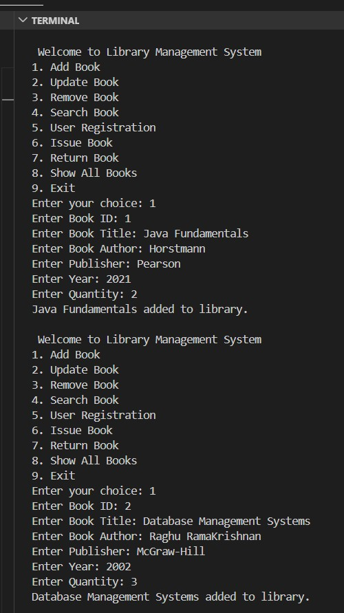
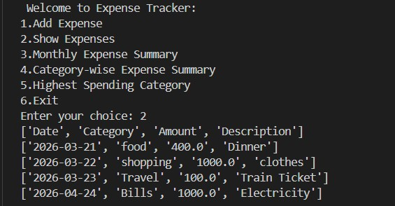

# 🚀 Pre-Training Projects Portfolio

---

# 🧩 Section 1: Mini Projects

---

## ☕ Java – Library Management System

📖 **Overview:**  
A console-based system designed to manage library operations efficiently.

📸 **Output Preview:**

  **➤ Add Book**
  
   **➤ Update Book**
 
   **➤ Search Book**
  
    **➤ User Register**
  
    **➤ Issue Book**
  
    **➤ Show Books**
  
    **➤ Return Book**
  
    **➤ Remove Book**
  

---

## 🗄️ SQL – Movie Recommendation System

🎬 **Overview:**  
A database-driven system that analyzes movie ratings and generates useful insights.

🔹 **Key Queries:**
-- Top rated movies
select v.title,Round(avg(r.rating),2) as avg_rating
from movies v
join ratings r on v.movie_id=r.movie_id
group by v.title
order by avg_rating desc
limit 3;

  

-- Genre popularity
select genre,count(*) as total
from movies
group by genre
order by total desc
limit 1;

  

-- recommend movies based on similar users
select distinct v.title
from Ratings r
join movies v on r.movie_id=v.movie_id
where r.user_id in(
	select r2.user_id from ratings r1
	join ratings r2
	on r1.movie_id=r2.movie_id
	where r1.user_id=1 and r1.rating>=4
	and r2.user_id!=1) 
and r.movie_id not in(
	select movie_id from ratings
    where user_id=1
)
and r.rating>=4;

  

---user behaviour patterns
select user_id,count(*) as movies_watched
from watch_history
group by user_id;

  

--trending movies
select v.title,count(*) as watch_count
from watch_history w
join movies v on w.movie_id=v.movie_id
group by v.title
order by watch_count desc
limit 3;

  

🐍 Python – Smart Expense Tracker

💰 Overview:
A simple application to track and analyze daily expenses.

📸 Output Preview:

  **➤ Add Expense**
  
   **➤ Show Expense**
 
   **➤ Category-wise Expense**
  
    **➤Highest Spending Category**
  

