# 💻 Pre-Training Mini Projects & Use Cases


---

# 📂 Section 1: Mini Projects

---

## ☕ Java – Library Management System

**Overview:**  
A console-based system designed to manage library operations efficiently.

📸 **Output Preview:**

| ➤ Add Book | ➤ Update Book |
|-----------|---------------|
| 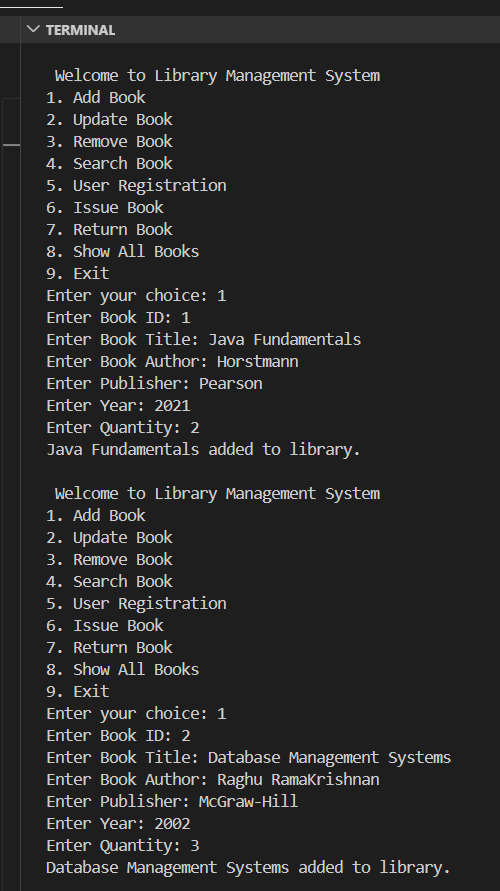 | 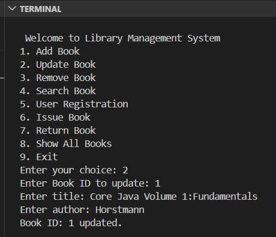 |

| ➤ Search Book | ➤ User Registration |
|--------------|--------------------|
| 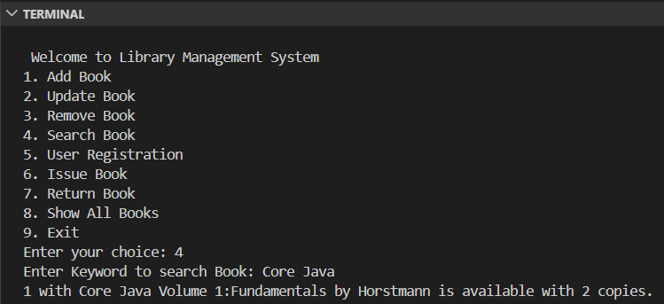 | 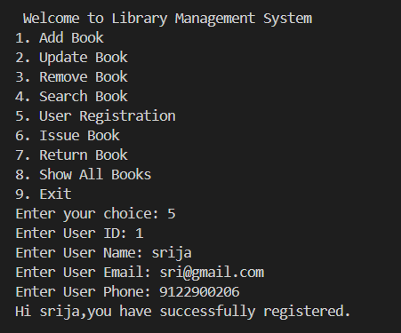 |

| ➤ Issue Book | ➤ Show Books |
|-------------|-------------|
| 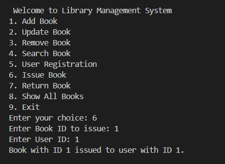 | 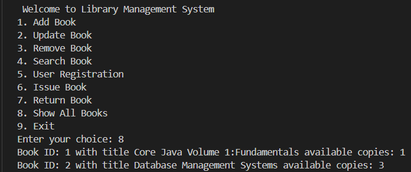 |

| ➤ Return Book | ➤ Remove Book |
|--------------|--------------|
| 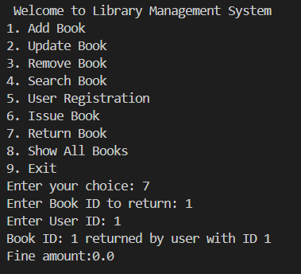 | 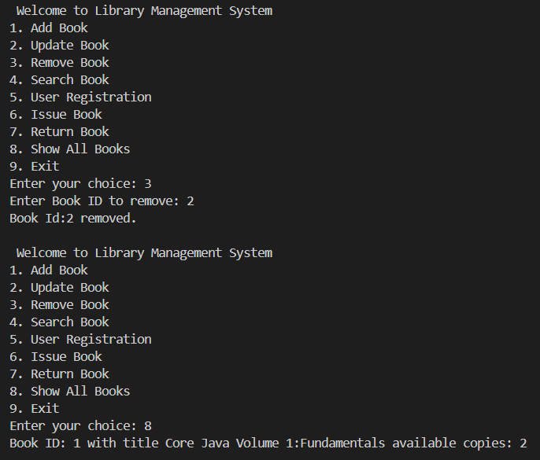 |

---

## 🗄️ SQL – Movie Recommendation System

**Overview:**  
A database-driven system that analyzes movie ratings and generates useful insights.


```Sql
--Top Rated Movies
SELECT v.title, ROUND(AVG(r.rating),2) AS avg_rating
FROM movies v
JOIN ratings r ON v.movie_id = r.movie_id
GROUP BY v.title
ORDER BY avg_rating DESC
LIMIT 3;
```
<p align="center"> 
    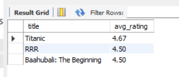  
</p>

```Sql
--Recommendation Query
SELECT DISTINCT v.title
FROM Ratings r
JOIN movies v ON r.movie_id = v.movie_id
WHERE r.user_id IN (
    SELECT r2.user_id
    FROM ratings r1
    JOIN ratings r2 ON r1.movie_id = r2.movie_id
    WHERE r1.user_id = 1 AND r1.rating >= 4
    AND r2.user_id != 1
)
AND r.movie_id NOT IN (
    SELECT movie_id FROM ratings WHERE user_id = 1
)
AND r.rating >= 4;
```
<p align="center"> 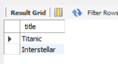 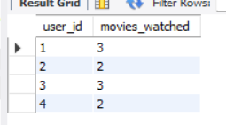 </p>

```sql
---Trending Movies
SELECT v.title, COUNT(*) AS watch_count
FROM watch_history w
JOIN movies v ON w.movie_id = v.movie_id
GROUP BY v.title
ORDER BY watch_count DESC
LIMIT 3;
```
<p align="center"> 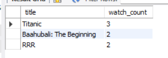 </p>

----
Python – Smart Expense Tracker

Overview:
A simple application to track and analyze daily expenses.

📸 Output Preview:

<p align="center"> 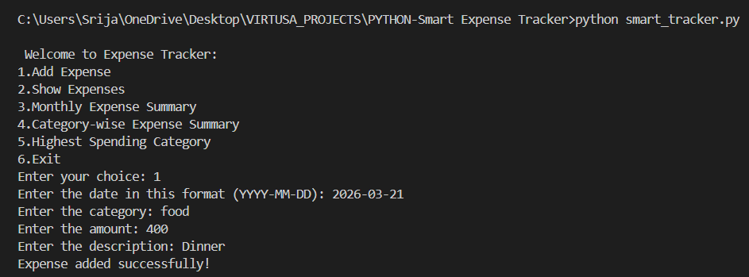 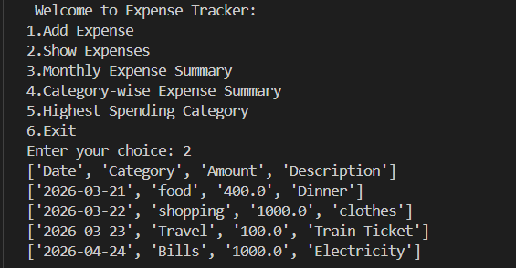 </p> <p align="center"> 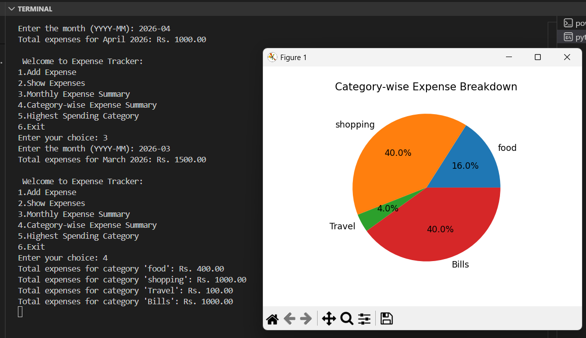 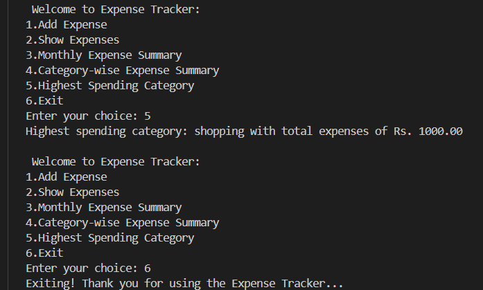 </p>
Section 2: Use Case Implementations
Java – FinSafe (Digital Wallet)

Overview:
A console-based application that simulates a digital wallet.

<p align="center"> 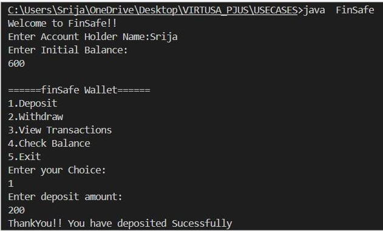 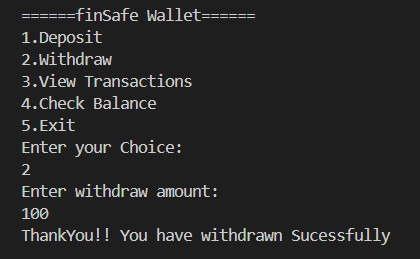 </p> <p align="center"> 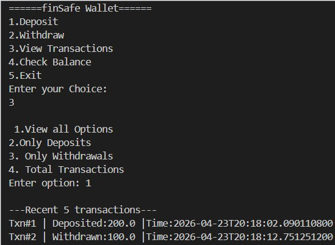 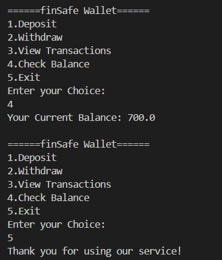 </p>
SQL – E-Commerce Logistics Tracker

Overview:
Tracks shipments and analyzes delivery performance.
```sql
--Delayed Shipments
SELECT *
FROM Shipments
WHERE ActualDeliveryDate > PromisedDate;
```
<p align="center"> 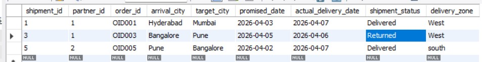 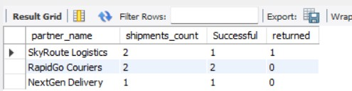 </p>

```sql
 Performance Analysis
SELECT target_city, COUNT(*) AS total_orders
FROM Shipments
GROUP BY target_city
ORDER BY total_orders DESC
LIMIT 1;
```
<p align="center">   </p>
---
Python – OpsBot

Overview:
Analyzes logs and generates alerts.

<p align="center"> 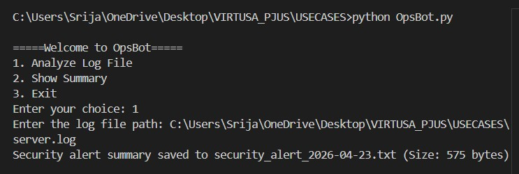 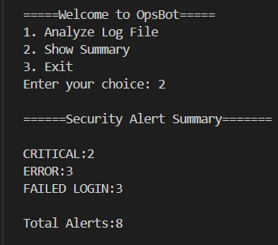 </p> ```
